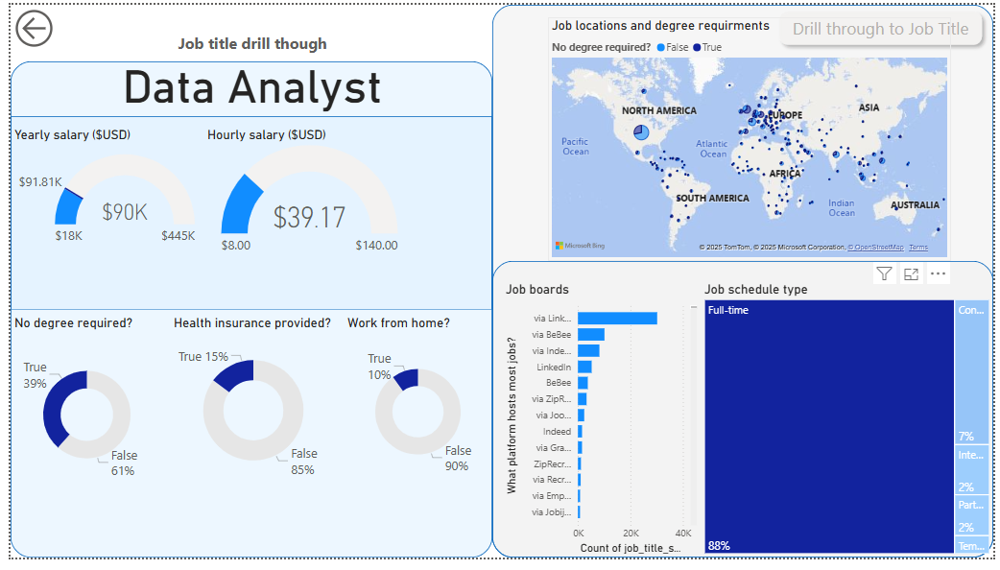

# Data Jobs Dashboard w/ Power BI

## Introduction

This dashboard was built by following **Luke Barousse’s official guided Power BI project**, which walks through building a complete data visualization solution from start to finish. The goal of the project is to analyze the 2024 data job market using a real-world dataset of job postings.

Targeted at **Job Seekers**, **Career Transitioners**, and **Job Swappers**, the dashboard helps solve a common problem: data about the job market is scattered and hard to interpret. This report brings it all together into an interactive, easy-to-use format that highlights key trends in job titles, salaries, and geographic demand.

---

## Skills Showcased

- **Data Transformation (ETL) with Power Query**  
  Cleaned, reshaped, and prepped raw job posting data by fixing blanks, updating data types, and engineering new fields.

- **Implicit Measures**  
  Built custom DAX measures to calculate key insights like *Median Yearly Salary* and *Job Count*.

- **Core Charts**  
  Used Column, Bar, Line, and Area Charts to track job volumes and trend changes over time.

- **Geospatial Analysis**  
  Included Map Charts to visualize global job distribution by location.

- **KPI Indicators & Tables**  
  Displayed top-line metrics using Cards and detailed listings with Tables for sortable, granular analysis.

- **Dashboard Design**  
  Focused on a user-friendly and clean layout, balancing standard charts with advanced visuals to support the story.

- **Interactive Reporting**  
  - Slicers to filter by job title and other fields  
  - Buttons & Bookmarks to allow smooth navigation across views  
  - Drill-Through Pages to move from high-level summaries into detailed job-level data
---

## Dashboard Overview

### Page 1: High-Level Market View

This is the main summary page. It gives a quick snapshot of what’s happening in the data job market—like how many roles are out there, what the typical salaries look like, and which job titles are most in demand.

---

### Page 2: Job Title Drill Through

This page is for digging deeper. You can drill into it from the main dashboard to see details for a specific job title—such as salary range, remote work breakdowns, hiring platforms, and where the roles are located globally.

---

## Conclusion

This project shows how Power BI can take raw job posting data and turn it into something powerful and insightful. With the ability to explore, filter, and drill into the data, users can better understand the job market and make more informed career decisions.